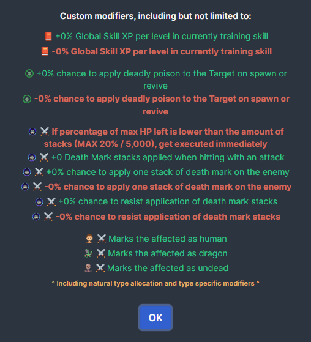
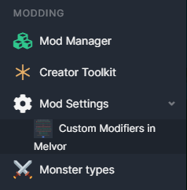
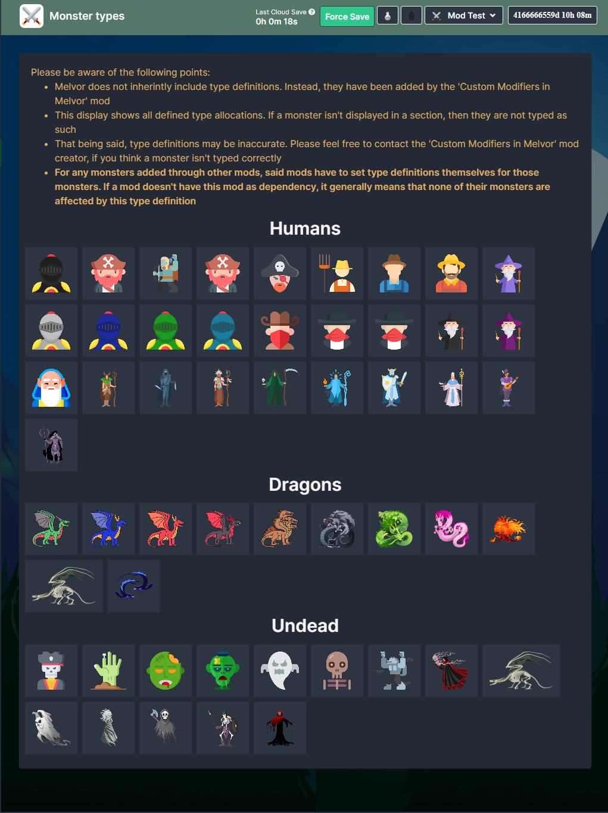

# **This mod is of no use on its own. The purpose of this mod is to add more modifiers to the game, which other mods can take advantage of.**
\
**IMPORTANT: More modifiers means more calculation. This means, that you may notice slightly longer calculation times of your offline gains. 
The impact shouldn't be noteworthy, though.**

## Regular Users
**You do not have to care about this mod, unless another mod has it set as a dependency and asking you to add it!**

That being said, if you **do** end up including this mod, you might end up stumbling onto type-specific modifiers (e.g. increasing damage against dragons specifically). 
If you do, feel free to have a look at the "Monster Types" view, which is accessible through the "Modding" section in the sidebar. It will display the configured monster type allocations to you, 
so you can always check whether a specific monster is interpreted as a specific type.\
\
_The overview will only display monsters loaded - monsters specific to expansions and mods you do not have, will not be displayed._\


## Mod Creators
Feel free to have a look at one of the files in `src/translation/languages`, which includes the effects of all modifiers.

Of course, if you use any of these modifiers, remember to flag this mod as a dependency for your mod.

### Monster type definition
Regardless of whether you want to use modifiers implemented by this mod yourself or not, 
if you add custom monster with your mod, 
then it would be nice to think about whether those monsters should have any form of type allocation.

For example, if you add a dragon, then by allocating that type to it (by checking whether the user has this mod installed), you 
you can allow those players to make use of modifiers added through this mod, even if you don't make direct use of those modifiers yourself.
To do so, just check whether the api object is defined, and call the type-registering method(s) for whatever monsters you see fit.
```js
if(mod.api.customModifiersInMelvor) {
	// If you only add one monster, make sure you still provide an array and not just a string accidentally
	mod.api.customModifiersInMelvor.addMonsters("Human", ["MOD_NAMESPACE:MONSTER_ID", "MOD_NAMESPACE:MONSTER_ID", "..."]);
	mod.api.customModifiersInMelvor.addMonsters("Dragon", ["MOD_NAMESPACE:MONSTER_ID", "MOD_NAMESPACE:MONSTER_ID", "..."]);
	mod.api.customModifiersInMelvor.addMonsters("Undead", ["MOD_NAMESPACE:MONSTER_ID", "MOD_NAMESPACE:MONSTER_ID", "..."]);
}
```