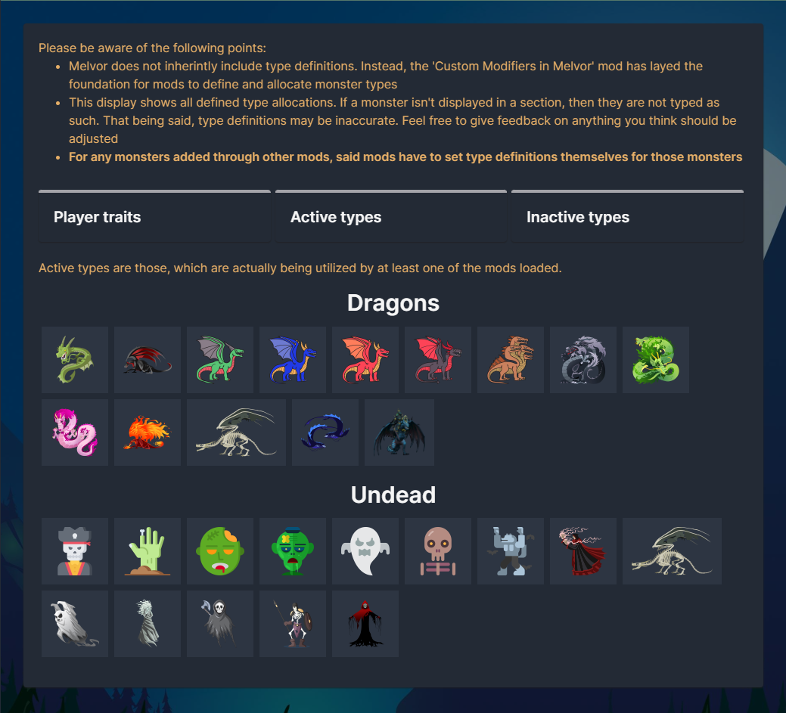

# **This mod is of no use on its own. The purpose of this mod is to add more modifiers to the game, which other mods can take advantage of.**
\
**IMPORTANT: More modifiers means more calculation. This means, that you may notice slightly longer calculation times of your offline gains. 
The impact shouldn't be noteworthy, though.**

## Regular Users
**You do not have to care about this mod, unless another mod has it set as a dependency and asking you to add it!**

That being said, if you **do** end up including this mod, you might end up stumbling onto type-specific modifiers (e.g. increasing damage against dragons specifically). 
If you do, feel free to have a look at the "Monster Types" view, which is accessible through the "Modding" section in the sidebar. It will display the configured monster type allocations to you, 
so you can always check whether a specific monster is interpreted as a specific type.\
\
_The overview will only display monsters loaded - monsters specific to expansions and mods you do not have, will not be displayed._\


## Mod Creators
Feel free to have a look at one of the files in `src/translation/languages`, which includes the effects of all modifiers.

Of course, if you use any of these modifiers, remember to flag this mod as a dependency for your mod.

### Monster type definition
One important thing to note is that this mod adds a couple of modifiers, which affect monsters of a certain type. 
For example, there is an `increasedMaxHitPercentAgainstDragons`, which, as the name suggests, 
increases your max hit by a certain percentage, but only against dragons.

As Melvor doesn't come with monster types by default, an alternative way had to be taken instead.
Basically, for each type, there is a static array of monster ids, that will be checked to see if a certain modifier should be applied against the current enemy.

If you add new monsters in your mod, then you will have to specifically register the types to the monsters you implement, in order for corresponding modifiers to take effect. 
To do so, you will have to call the following method(s) during your setup.
```js
mod.api.customModifiersInMelvor.addHumans(["MOD_NAMESPACE:MONSTER_ID", "MOD_NAMESPACE:MONSTER_ID", "..."]);
mod.api.customModifiersInMelvor.addDragons(["MOD_NAMESPACE:MONSTER_ID", "MOD_NAMESPACE:MONSTER_ID", "..."]);
mod.api.customModifiersInMelvor.addUndead(["MOD_NAMESPACE:MONSTER_ID", "MOD_NAMESPACE:MONSTER_ID", "..."]);
```

**NOTE**: You should use the in-game "monster types" entry in the modding-section of the sidebar, to verify that your monsters have been typed correctly.